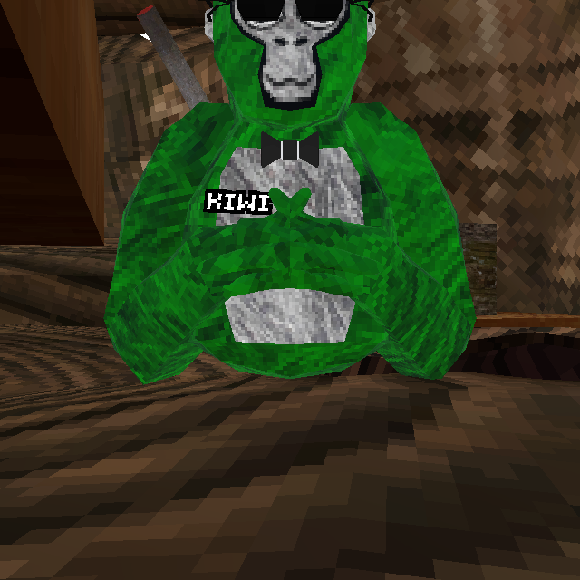
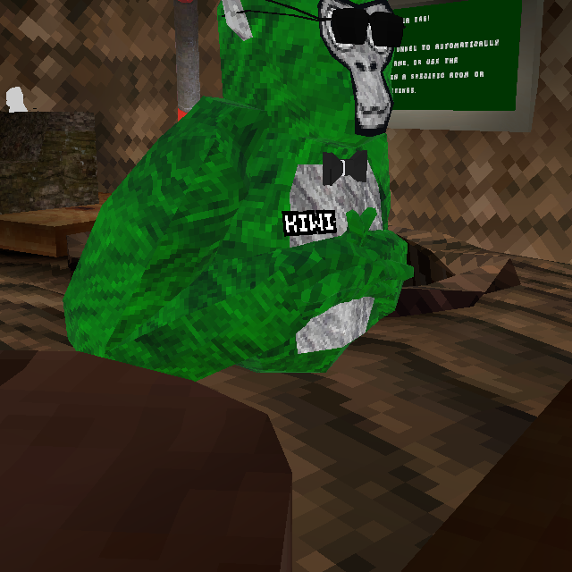
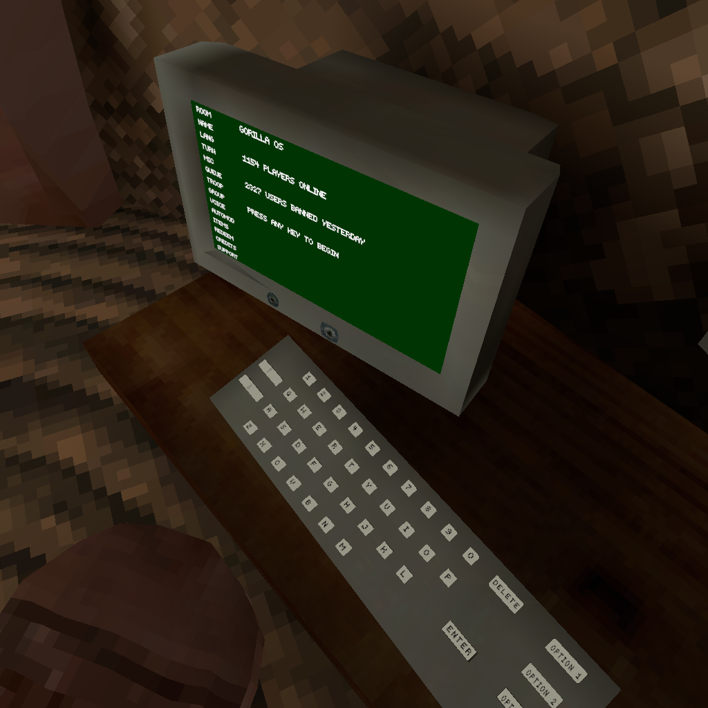
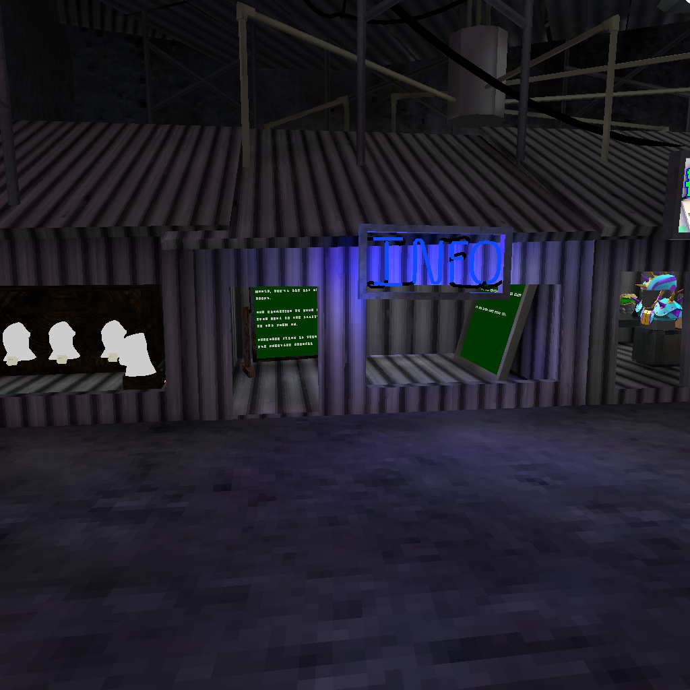
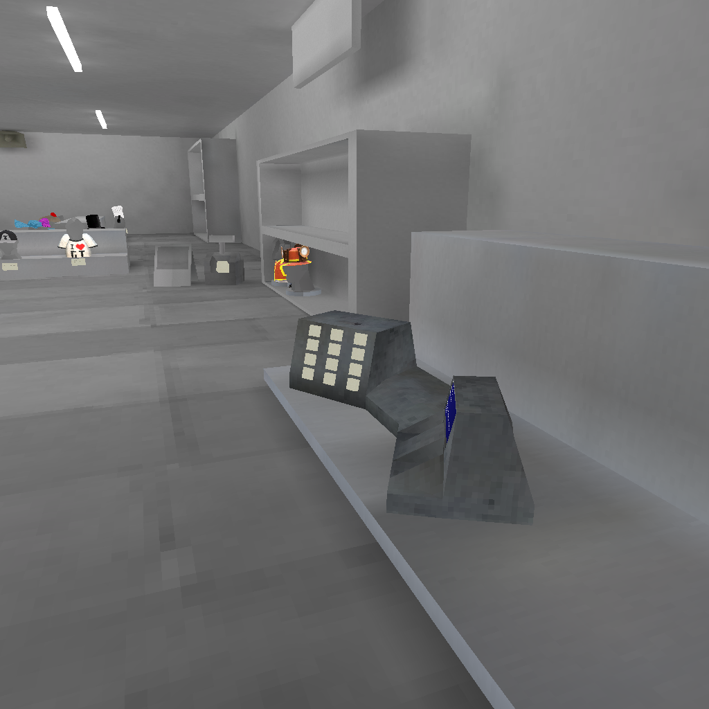
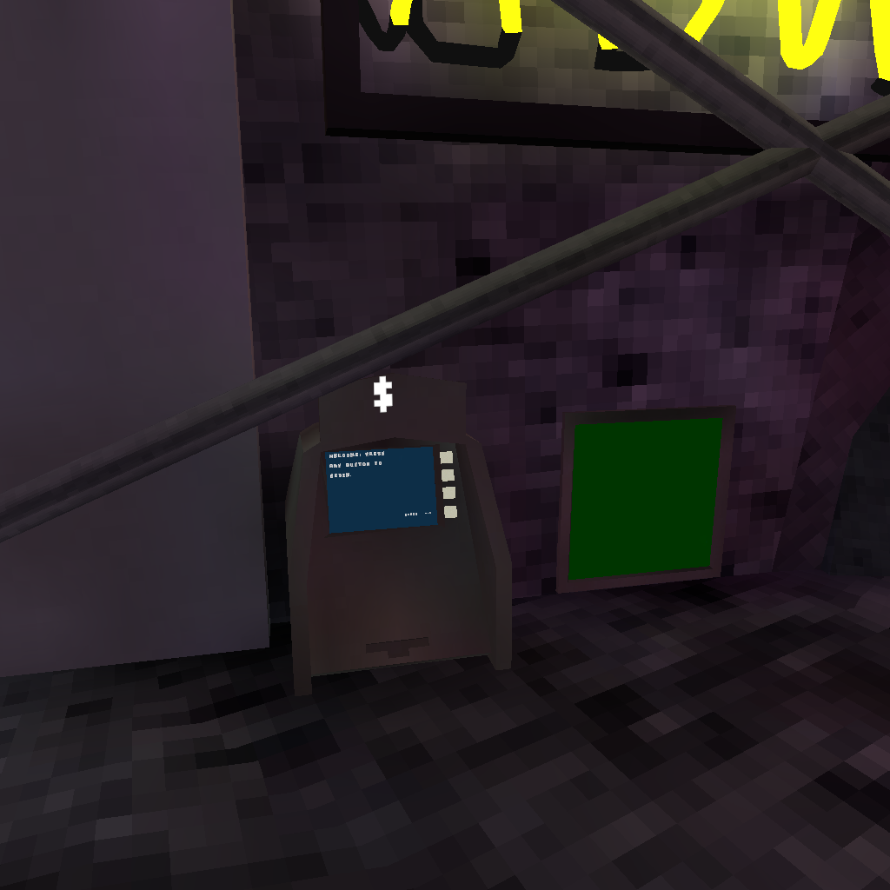
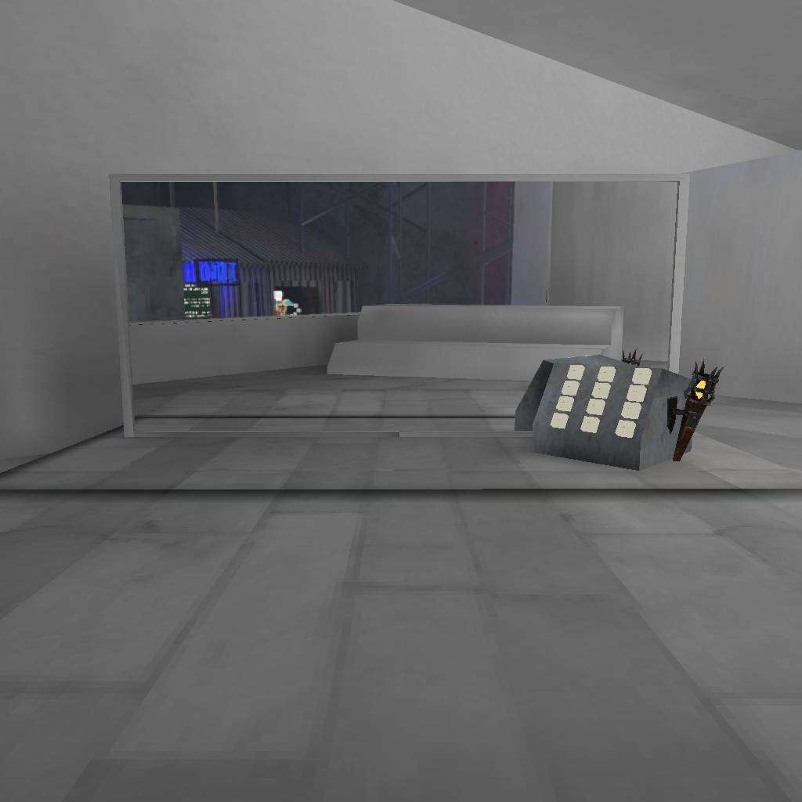
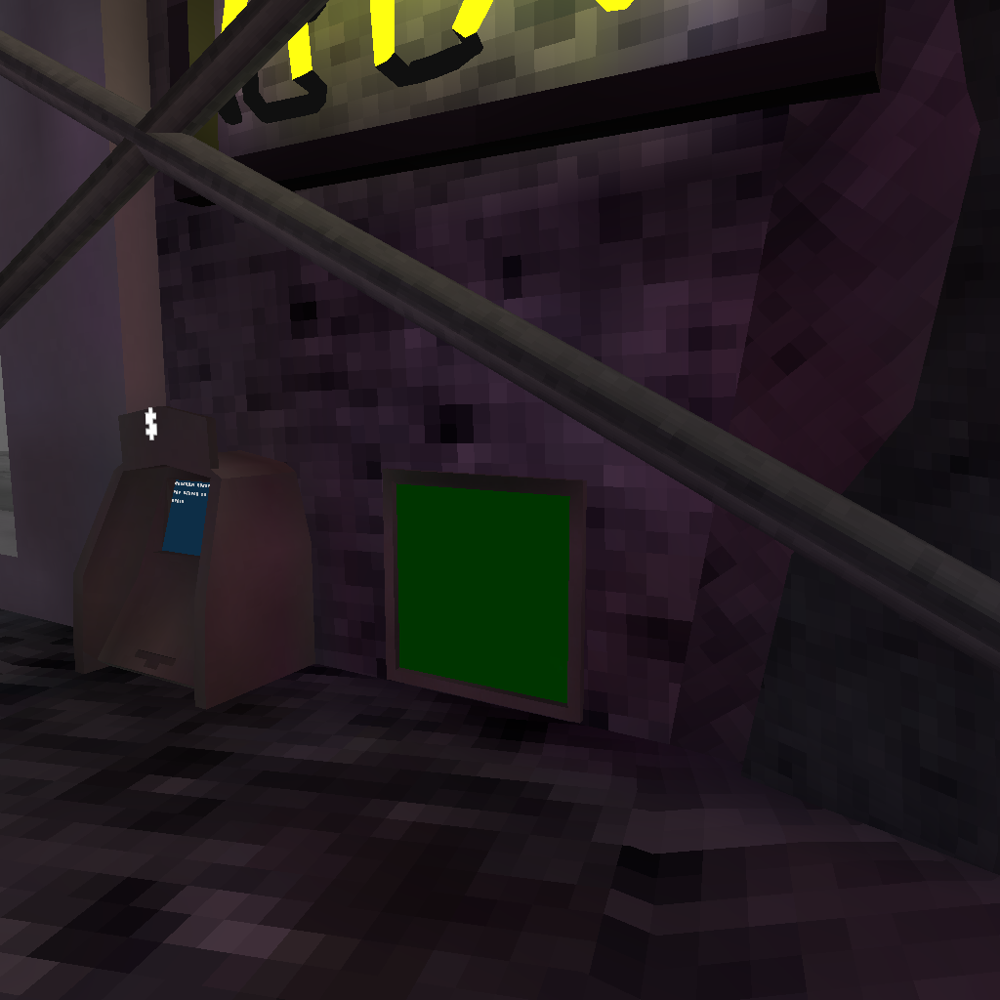
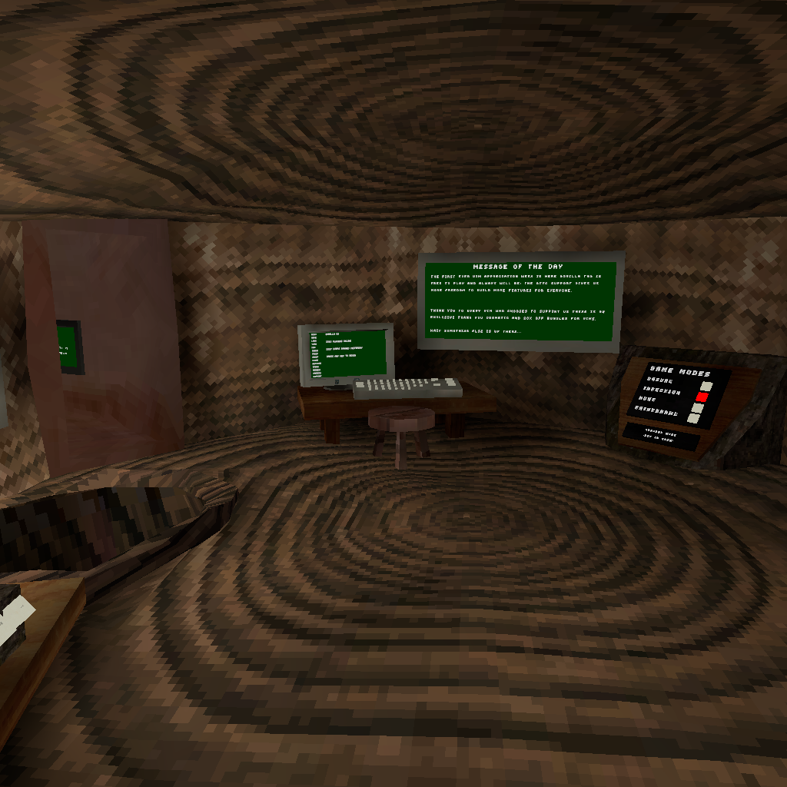
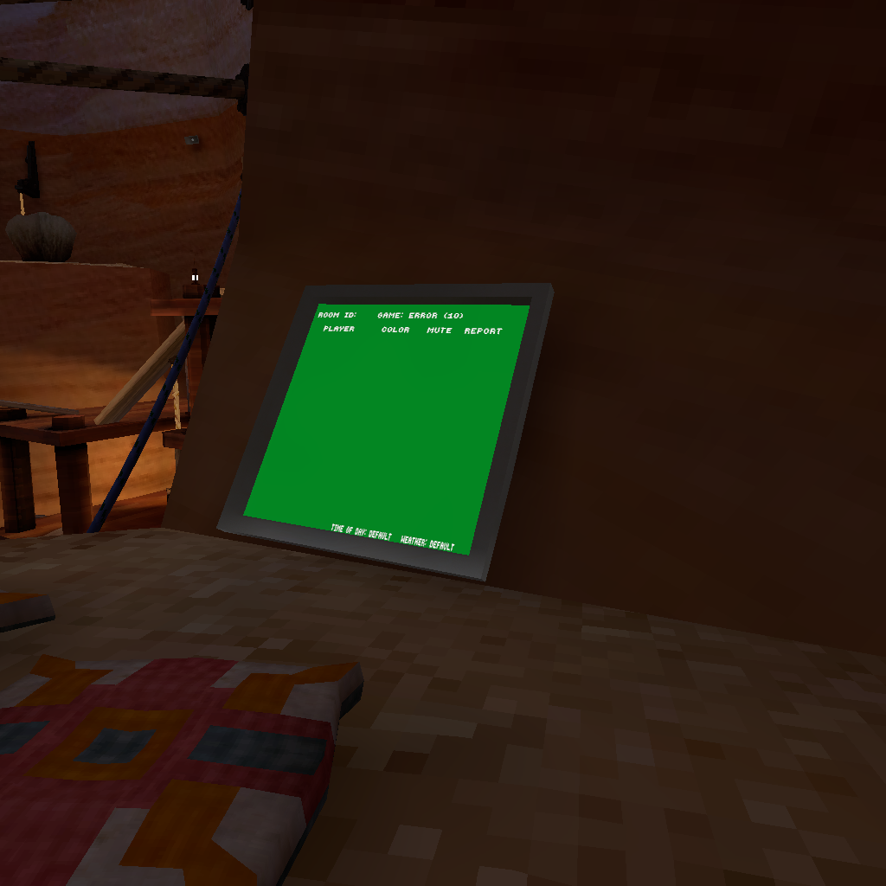

# 🦍 Gorilla OG V2 (Mod)

> **Step back into August 2023.** A [BepInEx](https://github.com/BepInEx/BepInEx) mod for
> [Gorilla Tag](https://store.steampowered.com/app/1533390/Gorilla_Tag/) (Steam, PC) that restores the
> **original August 11, 2023 player look, Stump, Forest, Canyon, Caves, Mountain — and the 2023 City store** —
> inside the current build of the game.

[](LICENSE)
[-brightgreen.svg)](https://store.steampowered.com/app/1533390/Gorilla_Tag/)
[](https://github.com/BepInEx/BepInEx)
[](https://github.com/shlingusjambo-glitch/GorillaOG-V2/releases)

---

## ✨ What is this?

If you miss how Gorilla Tag **looked and felt back in 2023**, this mod is for you. It brings back:

| 🏷️ Feature | 📝 Details |
|---|---|
| 🙈 **2023 player model** | The original gorilla mesh, fur + face textures, and 2023 shading |
| 🌳 **OG Stump & Tree Room** | Stump interior, computer terminal, game-mode board, keyboard, MOTD, rules & welcome text |
| 🌲 **OG Forest / Canyon / Caves / Mountain** | Historical geometry, 2023 lighting/sky, and period-correct spawn points |
| 🏙️ **2023 City store** | Shelves, checkout, ATM, mirror, wardrobe categories, scoreboards — as they were |
| 🎨 **Period-correct rendering** | Original point-filtered atlases, 2023 lightmaps, procedural 2023 sky |

### 🖼️ Screenshots *(captured in-game with this mod)*

**The 2023 gorilla — front & side:**

| Front | Quarter |
|---|---|
|  |  |

**OG Stump computer terminal:**



**2023 City store & checkout:**

| City view | Checkout |
|---|---|
|  |  |

| ATM | Mirror | Scoreboard |
|---|---|---|
|  |  |  |

**OG Forest & Canyon:**

| Forest | Canyon |
|---|---|
|  |  |

---

## 🚀 Install (2 minutes)

### What you need

- 🖥️ **Gorilla Tag on Steam** (PC / SteamVR — you must own the game)
- 🧩 **BepInEx 5** (x64) installed in your Gorilla Tag folder
- 📦 The **`GorillaOGV2-v1.0.0-Release.zip`** file from the
  [**Releases page**](https://github.com/shlingusjambo-glitch/GorillaOG-V2/releases)

### Steps

1. ⬇️ **Download** `GorillaOGV2-v1.0.0-Release.zip` from
   [Releases](https://github.com/shlingusjambo-glitch/GorillaOG-V2/releases).
2. 📂 **Unzip it straight into your Gorilla Tag install folder**, so you end up with:

   ```text
   Gorilla Tag/
   └── BepInEx/
       └── plugins/
           └── GorillaOGV2/
               ├── GorillaOGV2.dll
               └── historical-world/
                   ├── historical-world.bin
                   ├── lightmaps/
                   └── textures/
   ```

   > ⚠️ **Both parts matter!** The `.dll` alone won't work — `historical-world/` must sit
   > right next to it as shown above.
3. ▶️ **Launch the game.** The 2023 world loads automatically — no menu, no setup. 🦍🎉

### ⚙️ Optional settings

After the first launch, open `BepInEx/config/com.elywright.gorillaogv2.cfg`:

| Setting | Section | Default | What it does |
|---|---|---|---|
| `LegacyPlayer` | Restoration | `true` | 2023 player mesh & textures on/off |
| `HistoricalDiagnosticMode` | Rendering | `4` | Material debug views (`1`–`4`; leave at `4` for normal play) |
| `PlayerDebugCube` | Verification | `false` | Magenta-cube renderer test (dev only) |
| `ZoneTour` | Verification | `false` | Auto-tour + screenshot capture (dev only) |

---

## 🛠️ Build from source

You need the [.NET SDK](https://dotnet.microsoft.com/download) plus the game's managed DLLs
(`Assembly-CSharp.dll`, Unity modules, `BepInEx.dll`, `0Harmony.dll`).

```bash
# 1. Clone
git clone https://github.com/shlingusjambo-glitch/GorillaOG-V2.git
cd GorillaOG-V2

# 2. Point the <HintPath> entries in GorillaOGV2.csproj at YOUR install, e.g.
#    /home/you/.local/share/Steam/steamapps/common/Gorilla Tag/...

# 3. Build the public (non-debug) DLL
dotnet build -c Release --no-incremental
# => bin/Release/netstandard2.1/GorillaOGV2.dll
```

> 🔎 `Release` = the public build. `Debug` = the verification build (zone tour, proof
> captures, `[PERF]`/`[ZONE]`/`[TOUCH]` diagnostics) — not for normal play.

### 📁 Project layout

```text
GorillaOG-V2/
├── Plugin.cs                    # BepInEx entry point + config bindings
├── HistoricalWorld.cs           # Historical environment loader (zones, sky, lightmaps)
├── HistoricalStumpInteraction.cs# Stump interior: computer, boards, MOTD/rules text
├── HistoricalCityStore.cs       # 2023 City store restoration
├── HistoricalCityUi.cs          # 2023 City labels & UI text
├── HistoricalWardrobe.cs        # 2023 wardrobe categories
├── HistoricalScoreboards.cs     # Historical scoreboards
├── HistoricalCityMirror.cs      # City mirror
├── GorillaOGV2.csproj           # Build file (netstandard2.1)
├── assets/                      # Data embedded in the DLL at build time
└── docs/images/                 # Screenshots used above
```

---

## 📜 License & credits

- 📄 This mod's code is **free software** under the
  [**GNU General Public License v3.0**](LICENSE) — share it, fork it, improve it,
  as long as your version stays free too.
- 🎮 **You must own Gorilla Tag on Steam** to use this mod.
- 🙏 Fan-made project, **not affiliated with** Another Axiom / Gorilla Tag.
  Play nice, don't use mods to harass other players, and respect each lobby's rules. 💛
